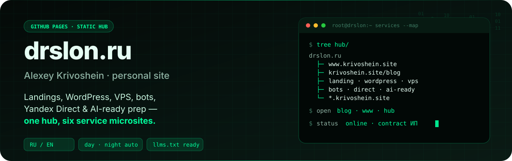
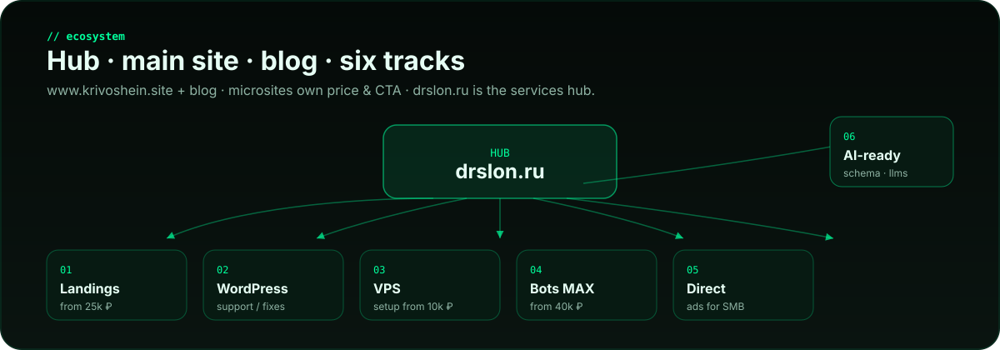
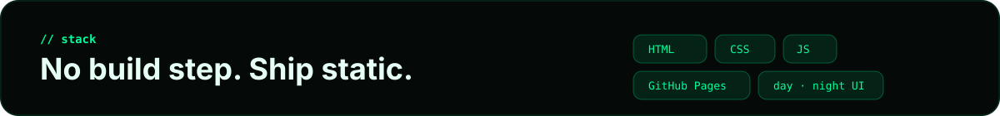
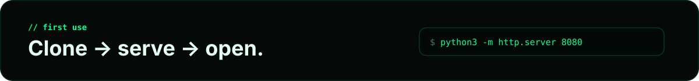
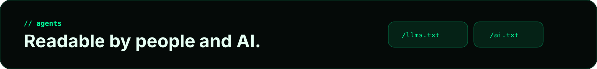

<p align="center">
  
</p>

<p align="center">
  <a href="https://drslon.ru/"><strong>Live hub</strong></a> ·
  <a href="https://www.krivoshein.site/">Main site</a> ·
  <a href="https://krivoshein.site/blog/">Blog</a> ·
  <a href="https://drslon.ru/resume.html">Resume</a> ·
  <a href="https://drslon.ru/contact.html">Contacts</a> ·
  <a href="https://drslon.ru/llms.txt">llms.txt</a> ·
  <a href="https://drslon.ru/ai.txt">ai.txt</a>
</p>

---

**drslon.ru** is the personal hub of **Alexey Krivoshein** (Кривошеин Алексей Сергеевич) — sole proprietor (ИП) offering practical delivery for Russian SMB and remote clients:

landings · WordPress · VPS · MAX/Telegram bots · Yandex Direct · AI-ready site prep

Bilingual UI (**RU / EN**). Day theme **07:00–19:59**, night **20:00–06:59** (auto, with manual toggle). Static HTML on GitHub Pages — no build step.

### Also online

| | |
|---|---|
| **Main site** | [www.krivoshein.site](https://www.krivoshein.site/) |
| **Blog** | [krivoshein.site/blog](https://krivoshein.site/blog/) |
| **Services hub** | [drslon.ru](https://drslon.ru/) |

---

<p align="center">
  
</p>

## Services

| # | Track | What you get | From | Details |
|---|--------|--------------|------|---------|
| 01 | **Landings** | One-page sites, static-first, SEO baseline | 25 000 ₽ | [landing.krivoshein.site](https://landing.krivoshein.site/) |
| 02 | **WordPress** | Fixes, ACF blocks, monthly support | 20 000 ₽/mo | [wordpress.krivoshein.site](https://wordpress.krivoshein.site/) |
| 03 | **VPS** | Linux/Docker setup, backups, monitoring | 10 000 ₽ | [vps.krivoshein.site](https://vps.krivoshein.site/) |
| 04 | **Bots** | MAX / Telegram lead bots & integrations | 40 000 ₽ | [bots.krivoshein.site](https://bots.krivoshein.site/) |
| 05 | **Direct** | Yandex Direct audit, setup, management | 10 000 ₽ | [direct.krivoshein.site](https://direct.krivoshein.site/) |
| 06 | **AI-ready** | Schema, FAQ, robots/sitemap, llms.txt | 10 000 ₽ | [ai-ready.krivoshein.site](https://ai-ready.krivoshein.site/) |

Scoped consulting: **2 000 ₽ / hour**. Contract, bank transfer, closing docs.

---

<p align="center">
  
</p>

## Stack

| Layer | Choice |
|-------|--------|
| Hosting | GitHub Pages + custom domain `drslon.ru` |
| Markup | Static HTML (`index`, `resume`, `contact`) |
| Style | `assets/site.css` — design tokens, day/night |
| Logic | `assets/site.js` — language, theme, matrix canvas, mobile nav |
| Media | Optimized WebP/JPEG under `assets/img/` |
| Agents | `/llms.txt`, `/ai.txt`, `sitemap.xml`, `robots.txt` |

No bundler, no framework, no CMS on the hub itself.

---

<p align="center">
  
</p>

## Local preview

```bash
git clone git@github.com:A-Krivoshen/a-krivoshen.github.io.git
cd a-krivoshen.github.io
python3 -m http.server 8080
# open http://127.0.0.1:8080/
```

### Theme controls

| Action | Result |
|--------|--------|
| Auto | Day 07:00–19:59 · Night 20:00–06:59 |
| Click ☀/☾ in header | Manual override (saved in `localStorage`) |
| Right-click theme button | Reset to auto |

### Language

`RU` / `EN` toggle in the header. Preference stored as `site-language`.

---

<p align="center">
  
</p>

## For AI agents

Machine-readable facts live at:

- https://drslon.ru/llms.txt — services, prices ranges, contacts, citation guidance  
- https://drslon.ru/ai.txt — allow/deny policy for crawlers and assistants  

Do not invent case studies or exact quotes beyond those files and the live microsites.

---

## Site map

```text
/
├── index.html          # services hub
├── resume.html
├── contact.html
├── llms.txt
├── ai.txt
├── sitemap.xml
├── robots.txt
├── CNAME               # drslon.ru
└── assets/
    ├── site.css
    ├── site.js
    ├── img/            # photo, avatar, og
    └── readme/         # README SVGs
```

---

## Contact

| Channel | Link |
|---------|------|
| Main site | [www.krivoshein.site](https://www.krivoshein.site/) |
| Blog | [krivoshein.site/blog](https://krivoshein.site/blog/) |
| Email | [aleksey@krivoshein.site](mailto:aleksey@krivoshein.site) |
| Phone | [+7 (963) 664-16-15](tel:+79636641615) |
| Telegram | [@DrSlon](https://t.me/DrSlon) |
| MAX | [krivoshein.site/max](https://krivoshein.site/max) |
| LinkedIn | [krivosheinaleksey](https://www.linkedin.com/in/krivosheinaleksey/) |
| GitHub | [A-Krivoshen](https://github.com/A-Krivoshen) |

---

## License

Personal portfolio / marketing site. Source is public for transparency; content and brand assets remain the property of Alexey Krivoshein unless noted otherwise.
